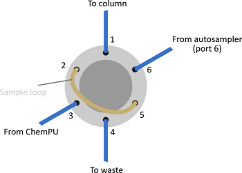
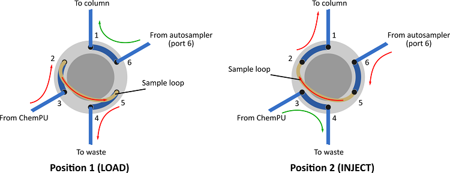

# Installation
## Magritek Spinsolve NMR
The instrument installation must follow the official Spinsolve Manual. To install the flow probe for liquid connection to the ChemPU, use only official Spinsolve Glass Flow Cell (Product code `SPGFC`) with corresponding connection kit (SPGFCFIT), otherwise the leakproof is not guaranteed! The connection kit supplied by Magritek is designed for continuous flow installation using a peristaltic pump and therefore is excessive for ChemPU installation. Only the following parts are needed:
- 2x Idex P-135 - threaded adapter.
- 2x Idex XP-132 - 3/16" (or 4.0 mm) OD tubing fitting; with P-133 Flangeless Ferrule (included).
- 2x Idex XP-235 - Flangeless fitting for 1/16" OD tubing, short; with P-200 Ferrule (included).

Install your fittings as shown below. Ensure all fittings are finger-tight to prevent leaking.


### Spinsolve Software
Follow the installation manual provided with the Spinsolve software. Alternatively it may be found in `\\SCAPA4\scapa4\group\0-Group\group-files\Software\Spinsolve`.

#### AnalyticalLabware integration
The instrument control via AnalyticalLabware library is achieved through the Spinsolve software - ensure the "Remote Control" option is activated in the preferences with port 13000 (default).

### Current instruments

| Instrument                | Hardware ID | Software version | Last updated | Responsible person            |
| ------------------------- | ----------- | ---------------- | ------------ | ----------------------------- |
| Spinsolve Carbon 80       | SPA1830     | 1.17.6           | 12/05/2022   | Steven O'Sullivan (Chemify)   |
| Spinsolve Carbon 60 Ultra | SPA1111     | 1.17.6           | 12/05/2022   | Dario Caramelli (Chemify)     |
| Spinsolve Carbon 43       | SPA261      | 1.17.6           | 12/05/2022   | Andrius Bubliauskas (Chemify) |
| Spinsolve Carbon 80 Ultra | tba         | tba              | 12/05/2022   | Michael Jirasek               |

To update the Spinsolve software, please forward your request to [Anna Gerdova](mailto:annag@magritek.com), including your current software version and Hardware ID. There is a chance you will be required to update the license files as well, but the step-by-step guide will be provided.

## Agilent HPLC
### Hardware
Follow the installation manual for each instrument you are installing. Follow the recommended configuration for either 1- or 2-stack setup. The information below assumes the following modules are used (Agilent 1260 Infinity system):
- Quaternary Pump - [G1311B][G1311B manual]
- High Performance Autosampler - [G1367E][G1367E manual]
- Thermostatted Column Compartment - [G1316A][G1316A manual]
- Diode Array Detector - [G1315D][G1315D manual]

Finish the installation by chaining each module to the detector using supplied cables. The detector module is connected to the network switch or network port of the workstation PC.

[G1311B manual]: https://www.agilent.com/cs/library/usermanuals/public/G1310-90016_Iso-QuatPump-B_USR_EN.pdf
[G1367E manual]: https://www.agilent.com/cs/library/usermanuals/public/G1367-90014_HiP-ALS_USR_EN.pdf
[G1316A manual]: https://www.agilent.com/cs/library/usermanuals/Public/G1316-90014_TCC-A_USR_EN.pdf
[G1315D manual]: https://www.agilent.com/cs/library/usermanuals/public/G1315-90015_DAD-MWD-CD_USR_EN.pdf

#### Idex Sample loop valve
Typical HPLC installation within the ChemPU includes the IDEX MX Series II Valve module (MXP7900-000) to inject the sample into the HPLC. Below is a step-by-step instruction to set up the module and use it through Serial-to-Ethernet(TM) converter.

1. Ensure RS-232 connection mode of IDEX MX Series II Valve module (referred further as “valve”). If factory-set to I2C, dissemble the module and change the two jumpers to set the connection mode (Figure 1).


**Figure 1.** Position of the jumpers to select communication mode for the valve (marked with red).

2. Connect the valve to PC via USB and set the command mode to "Dual-pulse logic" using Rheodyne TitanMX Control Software[^1].
	1. If the remote control software is not available, connect the valve to PC using RS-232 cable with an appropriate adapter (e.g. RS-232 - USB) using default serial communication settings[^2]:
		- 19.2K baud rate;
		- 8-N-1;
		- No hardware/software handshaking.
	2. Use the command `F05<CR>` to set the command logic to "dual-pulse".
	3. Restart the valve.
3. Prepare a Y-shaped cable with female DB-9 connector for PC and two male DB-9 connectors for the valve and HPLC using the wiring diagram below. You can omit the connection to the autosampler and trigger the method acquisition using the HPLC software.


**Figure 2.** Wiring diagram for PC-Valve-HPLC cable. Detailed description of pin signal for valve[^3] and HPLC autosampler[^4] can be found in references. a) use pin 8 on IDEX valve connector if you want to trigger HPLC upon switching the valve to position "2"; use pin 9 for position "1" respectively.

4. Connect the PC, valve and HPLC autosampler and use the commands listed in [^2] for communication.

### Liquid path
Assuming the Sample Loop valve is installed to inject the sample from ChemPU into HPLC, connect the tubing to the Valve (IDEX MXP7900-000) as shown on the diagram:



When assembling the liquid path on the Agilent HPLC, connect the pump to the autosampler (port 1) and attach the column inlet port to the port 1 of the sample loop valve. This will allow operating the instrument using either sample loop valve (e.g. with ChemPU) or Autosampler.
The operating principle of the sample loop valve is shown below:



After loading the sample from the ChemPU into the sample loop (position 1), switch the valve into position 2 and start the method to pump sample from the sample loop into the column.

### Agilent Software
To operate your instrument you will need an Agilent OpenLab CDS software. Installation files can be found on scapa: `\\scapa4.chem.gla.ac.uk\scapa4\group\0-Group\group-files\Software\Agilent OpenLAB CDS`. For all questions regarding the licenses, please contact [Jim McIver](mailto:James.McIver@glasgow.ac.uk).

#### Network configuration
Follow the configuration process described in the _detector_ manual.
##### tl;dr
1. Connect the HPLC directly to the workstation PC.
2. Ensure the Initialization Mode Switches are configured to load the default configuration (i.e. SW6 - OFF, SW7 - ON, SW8 - ON). This should come by default.
3. Setup the corresponding network as follows:
	- IP address: 192.168.254.1
	- Subnet mask: 255.255.255.0
	- Default gateway: not specified.
4. Open the Telnet session with the instrument, using its default IP address (192.168.254.11).
	`telnet 192.168.254.11`
5. Setup the desired IP address with the following command: `ip 192.168.1.142`. You may check if the set up was successful by typing `/` command to list current settings.
6. Exit the telnet session by typing `exit`.
7. Set the Initialization Mode Switches to the "Using Stored" configuration (i.e. SW6 - OFF, SW7 - ON, SW8 - OFF). The module will be rebooted. If required - restart it manually.

After setting the new IP address, the instrument can be connected through the network switch and configured using Agilent OpenLab Control Panel with the new IP address.

#### AnalyticalLabware integration
The instrument control is achieved using the special macro in the Agilent Chemstation software. To activate the macro, copy the corresponding file `hplctalk.mac` from the AnalyticalLabware to the core folder of the chemstation installation (`C:\Chem32\CORE` by default).  Then activate it by typing the following commands in the Chemstation command line:
1. `macro hplctalk.mac` -> activate the macro.
2. `HPLCTalk_Run` -> start command monitoring.

**Alternatively** after copying the macro file you can add the commands to the `user.mac` macro file (or create it if does not exist). The `user.mac` macro is executed every time the Chemstation software starts, so your script will run by default. Example of new `user.mac` file below:
```
macro hplctalk.mac
HPLCTalk_Run
```

**Note**
Ensure the path to the corresponding command and reply files exist (see line 70 of the macro), otherwise change it and provide the new path when ininitializing the `HPLCController` class.

### Method development
The IDEX sample loop valve is rated to 414 bar maximum pressure, so ensure the same limit is set for your favorite method.
___
### References
[^1]: MX Series II Operating Manual from 10/20/2016 pp. 13-14, IDEX Health & Science LLC, www.idex-hs.com.

[^2]: UART/USB Communication Protocol for TitanEXTM/TitanEZTM/TitanHPTM, TitanHTTM Driver Boards and MX Series IITM Modules from 10/20/2016, IDEX Health & Science LLC, www.idex-hs.com.

[^3]: Driver/Controller Development Assistance Package For IDEX Health & Science MX II from 10/21/2016, IDEX Health & Science LLC, www.idex-hs.com.

[^4]: Agilent 1260 Infinity High Performance Autosampler User Manual, Agilent Technologies, Inc, pp. 181-182.
